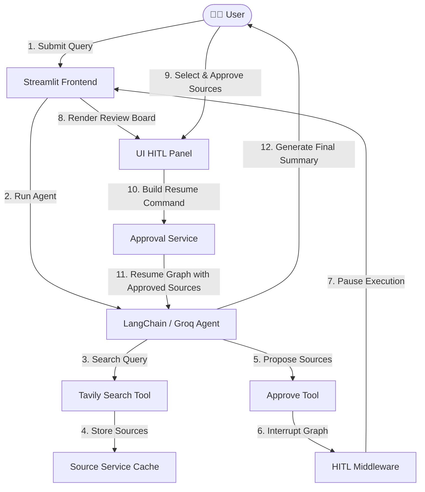

# 🧠 Sage B/C Research & Information Gathering Assistant

Welcome to the **Sage B/C Research Assistant**, a premium, state-of-the-art information-gathering agent built with **LangChain**, **LangGraph**, and **Streamlit**. 

This assistant is designed to perform autonomous web research on any topic using the **Tavily Search API**, process and group the found resources, and pause execution for **Human-in-the-Loop (HITL) approval** before synthesizing the final intelligence report using a high-performance **Groq LLM**.

---

## 🗺️ Architectural Flow & Decision Loop

The research assistant utilizes a robust, unidirectional state-management pattern. When the agent attempts to propose sources for approval, the execution is securely interrupted, yielding control back to the human reviewer via the interactive board.



---

## ✨ Features

- **Autonomous Research Engine**: Leveraging `Tavily Search` for deep, high-quality, and multi-perspective web searches.
- **Strict HITL Interruption**: Configured middleware ensures the LLM can *never* bypass human review or summarize unchecked sources.
- **Granular Approval Board**:
  - Filter candidate sources in real-time.
  - Check/uncheck individual sources to select only the highest-quality references.
  - Approve to edit the tool arguments dynamically and resume execution.
  - Reject with direct textual feedback, directing the agent back to the search phase.
- **Clean Service Architecture**: Business logic is decoupled from UI rendering, ensuring robust modularity, simple unit testing, and predictable state synchronization.
- **Premium Calmed UI**: Elegant typography, high-contrast visual states, responsive alerts, and professional status indicators.

---

## 🛠️ Project Structure

```bash
langchain_agent/
├── agents/
│   └── info_agent.py         # Agent graph initialization, system prompts, LLM setup
├── config/
│   └── settings.py           # Configuration manager for env settings & key validations
├── middleware/
│   └── hitl.py               # LangGraph Human-in-the-Loop interruption middleware
├── services/
│   ├── approval_service.py   # HITL logic, Command structures (Edit, Reject), filters
│   ├── chat_service.py       # Message polling, interruptions checks, graph invocation
│   ├── source_service.py     # Thread-safe dual-channel caching for search documents
│   └── state_service.py      # Streamlit session-state manager, thread UUID management
├── tools/
│   ├── approve_tool.py       # Intercepted tool definition for source submissions
│   └── search_tool.py        # Tavily integration, caching logic, format utilities
├── ui/
│   ├── chat.py               # Chat bubbles and premium styling
│   ├── header.py             # Top status bar and header information
│   ├── sidebar.py            # Configuration details & state controllers
│   ├── styles.py             # Glassmorphism and premium CSS injection
│   └── hitl_panel.py         # Source selection board & action dispatchers
├── tests/                    # Complete mock-enabled pytest suite
├── main.py                   # Main CLI entrypoint to launch Streamlit
├── app.py                    # Streamlit layout core execution thread
└── pytest.ini                # Test path mappings
```

---

## 🚀 Setup & Installation

### 1. Prerequisites
- **Python 3.10 to 3.13** installed on your system.

### 2. Install Dependencies
Clone the repository and set up a virtual environment:

```bash
# Navigate to workspace
cd langchain_agent

# Create and activate virtual environment
python3 -m venv .venv
source .venv/bin/activate

# Install required libraries
pip install -r requirements.txt
```

### 3. Environment Configuration
Create a `.env` file in the root directory by copying the example:

```bash
cp .env.example .env
```

Open `.env` and fill in your keys:

```env
# Required credentials
GROQ_API_KEY=gsk_your_groq_api_key_here
TAVILY_API_KEY=tvly-your_tavily_api_key_here

# Optional model override (Default: llama-3.1-8b-instant)
GROQ_MODEL=llama-3.3-70b-versatile
```

> [!IMPORTANT]
> Both `GROQ_API_KEY` and `TAVILY_API_KEY` are **strictly required** for the agent to initialize. The app will prompt you with a visual validation error if keys are missing.

---

## 💻 Running the Application

To launch the Streamlit frontend dashboard, run the main entry point:

```bash
python main.py
```

This will spin up a local development server, typically opening at `http://localhost:8501`.

---

## 🧪 Running the Test Suite

The project includes a 100% mocked, reliable test suite covering all services and tools. You can run it inside your virtual environment using `pytest`:

```bash
# Run all unit tests with verbose outputs
pytest -v
```

---

## 📖 End-to-End Usage Example

Let's walk through a typical session of gathering intelligence on a topic.

### Step 1: Submitting a Request
You type the following prompt into the chat input field:
> *"Gather sources on the latest advancements in solid-state battery technology and write a summary."*

### Step 2: Agent Gathers Information
1. The agent initializes, recognizes that it needs sources, and calls the `search` tool with the query: `"solid state battery technology advancements"`.
2. The `search` tool queries the Tavily API and fetches 5-6 sources containing page titles, URLs, and snippets.
3. The results are parsed and securely cached inside the **Source Service**.
4. The agent categorizes these sources and attempts to submit them to the user by calling `approve(sources="...")`.

### Step 3: HITL Interruption (The Review Board)
At this point, the LangGraph engine intercepts the `approve` tool execution. The application switches states:
- The standard chat box is temporarily locked.
- A beautiful, high-contrast **Human-in-the-Loop Review Board** slides into view.

**What you will see in the UI:**
- **Source List**: Interactive cards showing the Title, URL, and a full snippet for each gathered source.
- **Search Filter**: A text input to query your results (e.g., typing *"Toyota"* will filter down to sources mentioning Toyota).
- **Control Buttons**:
  - `Select All` / `Deselect All` checkboxes.
  - `Approve Selected` (with indicators showing how many sources are checked, e.g., *"Approve Selected (4/5)"*).
  - `Provide Feedback & Search Again` text area and rejection button.

### Step 4: Making a Decision

#### Option A: Approve & Resume (Ideal Path)
1. You review the sources and uncheck Source #3 because it is a low-quality blog post.
2. You click **Approve Selected (4/5)**.
3. Under the hood:
   - The UI grabs the checked sources.
   - `services/approval_service.py` formats these sources into a structured block.
   - It builds an **Edit Command** modifying the `approve` tool call arguments with *only* these 4 sources.
   - The graph resumes.
4. The LLM receives the confirmed sources, processes their detailed content, and outputs a highly polished summary directly to the chat!

#### Option B: Reject & Revise (Redirect Path)
1. You review the sources and notice they are outdated.
2. In the feedback input box, you type:
   - *"These sources are from 2022. Please find recent breakthroughs from late 2025 or 2026."*
3. You click **Provide Feedback & Search Again**.
4. Under the hood:
   - `services/approval_service.py` builds a **Reject Command** carrying your text instructions.
   - The graph resumes, returning the rejection error message to the agent.
5. The agent reads your feedback, adjusts its query, and performs a *new* search on Tavily (e.g. `"solid state battery breakthroughs 2025 2026"`), bringing you back to **Step 3** with fresh, relevant sources!

---

## 💡 Best Practices & Customization

- **Model Selection**: For quick testing, `llama-3.1-8b-instant` is extremely fast. For complex multi-perspective summarization, set `GROQ_MODEL=llama-3.3-70b-versatile` in your `.env`.
- **Parallel Tool Protection**: The agent configuration explicitly sets `parallel_tool_calls=False`. This prevents the LLM from executing a search and trying to self-approve in the same cycle, ensuring reliable HITL flow.
- **Thread Safety**: Reset the workspace thread at any time by clicking the **"New Thread"** button in the sidebar. This wipes all checkpoint records and memory, generating a fresh unique session ID.
